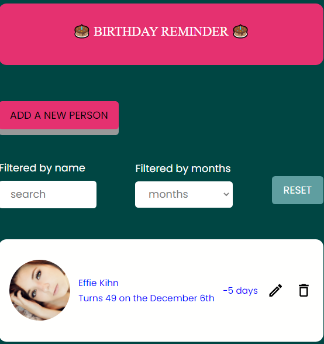

## Birthday app

## 1- Where you can find my works
[Demo](https://prisca-birthday-app.netlify.app/)
[solution](https://github.com/ravinalamada/birthday-app)
 ### 2- The structure of my project
    First, I generated the basic html in the index.html file. Second, I grabbed all the elements which am going to use. Third, I created a fucntion that fecth the people birthday. After that I created many function inside of the fecth function because all the function based on it.Fistly, I generated the function that will display the list of the person's birthday in the DOM. Secondly, I generated a function that set the time which the user has to wait while they use the app. Thirdly, I generated a function that destroy the popup so that every time the user has done something the popup will disappear. Forthly, I created a function that allows the user to edit the data. After that, I created another function that allows a user to cancel the popup. And then, I geneated a function that allows the user to delete the the birthday list. Finaly, I listened to all events.

### 3-Overviews

### 4- Improvements
If I had more time I would make everything works and then refactor my code in order to get it neater.
### 5- Something that I learned
I learned many things from this project because there are lots new things that I occured such as working with date. What's more, I learned how to work with local storage and fetch at the same time.
### 6- Biggest challenge
I had a great deal of difficulty in converting the birthday time stamp into a normal date. I didn't know how to sort the number of days. I was also struggling to make the local storage work.

### 7-Built with
- React
- html
- css
### How to use it
  You need to gt the dependency with 'npm init' and then install react by doing this 'npm install react ' and finally run parcel.
### 8-Comments
It was such an enjoyable project. Thank you so much for structuring it.
## 9-Contacts
- Website [netlify.com](https://prisca-birthday-app.netlify.app/),
- GitHub [@ravinalamada](https://github.com/ravinalamada/birthday-app),
